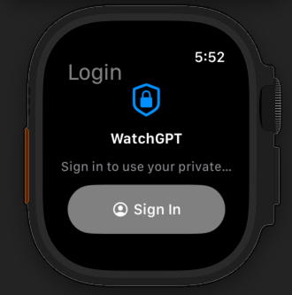
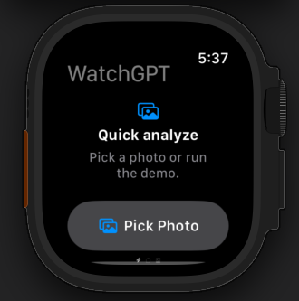
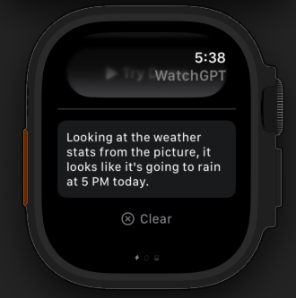
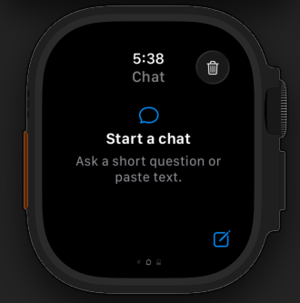
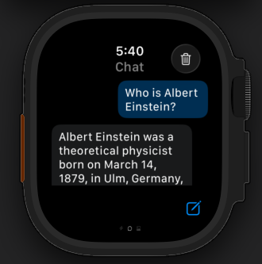
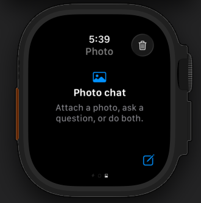
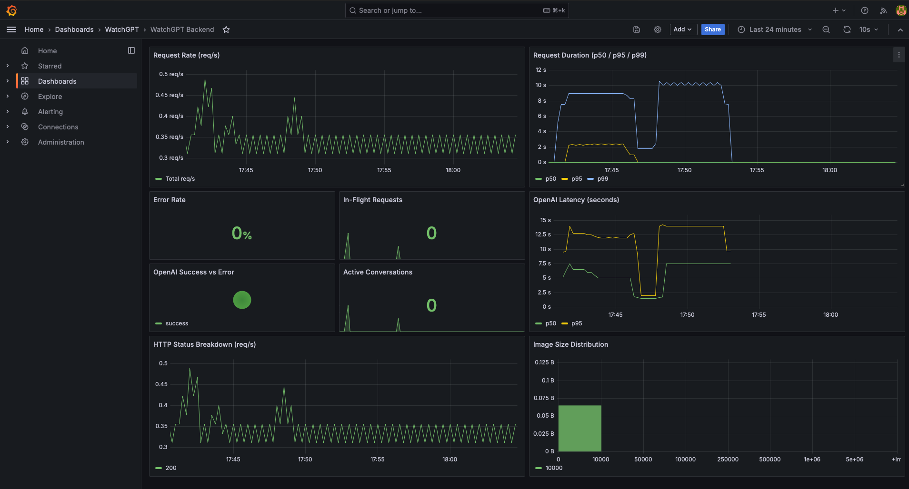
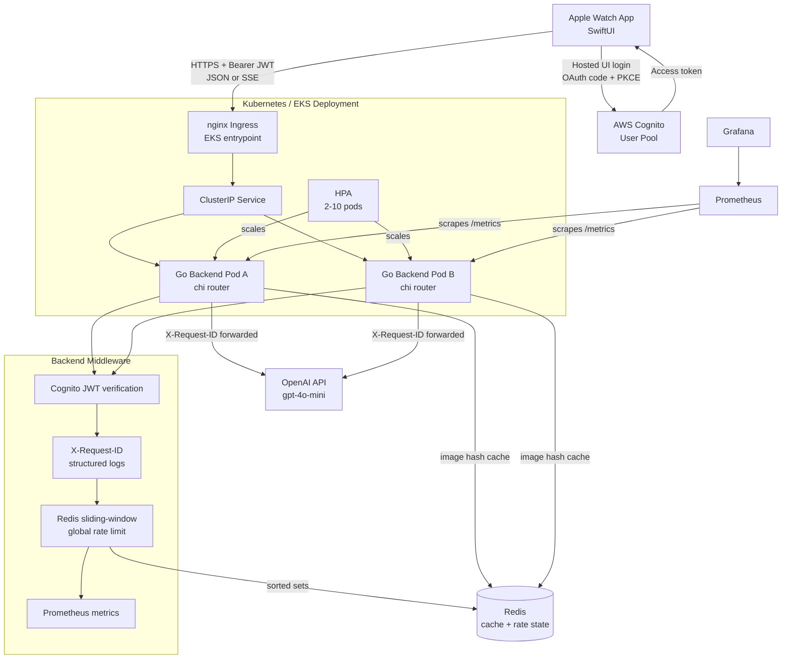

# WatchGPT

> AI-powered photo analysis and chat on Apple Watch, backed by a production-style Go backend.


WatchGPT is a watch-first AI assistant. Pick a photo for instant analysis, or type a question and get a streamed answer on your wrist. The watch handles selection and UI; a Go backend behind it owns everything else: model calls, caching, auth, rate limiting, tracing, and observability. Most AI chat apps are phone-first; this project explores what a fast, glanceable experience looks like when the heavy lifting happens server-side.

The results are measurable: non-streaming p50 latency moved from **4.03s to 2.06s** after switching to gpt-4o-mini, streaming time-to-first-token landed around **200ms**, cache hits return in **under 1ms**, and a local `/health` load test sustained **~51.8k req/s** with **822μs p50**.

The system runs on **AWS EKS**, with the backend image published to ECR, nginx ingress as the public entry point, two backend replicas, Redis, HPA autoscaling, and full observability (Prometheus + Grafana). All manifests are checked into the repo.

## App Walkthrough

<table>
  <tr>
    <td align="center"><br/><b>Cognito Login</b><br/>OAuth + PKCE sign-in</td>
    <td align="center"><br/><b>Quick Analyze</b><br/>Pick a photo to analyze</td>
    <td align="center"><br/><b>AI Response</b><br/>Streamed analysis result</td>
  </tr>
  <tr>
    <td align="center"><br/><b>Text Chat</b><br/>Ask any question</td>
    <td align="center"><br/><b>Chat Response</b><br/>Tokens stream in real-time</td>
    <td align="center"><br/><b>Photo Chat</b><br/>Image + follow-up conversation</td>
  </tr>
</table>

## Observability

<p align="center">
  
</p>

9-panel Grafana dashboard tracking request rate, latency percentiles (p50/p95/p99), error rate, in-flight requests, OpenAI latency, success/error ratio, active conversations, HTTP status breakdown, and image size distribution.

## Architecture



## Tech Stack

| Layer | Technology | Why this over alternatives |
|---|---|---|
| Watch UI | SwiftUI + watchOS | Native watch UI with small-screen layouts, PhotosPicker, and async networking without a web wrapper. |
| Auth client | Cognito Hosted UI + PKCE | Avoids storing passwords in the app, supports OAuth code flow, and keeps tokens in Keychain. |
| Backend language | Go | Small static container, simple concurrency model, and predictable latency for streaming HTTP handlers. |
| Router | chi | Lightweight, stdlib-compatible routing and middleware without the extra framework surface of larger routers. |
| AI boundary | Go proxy to OpenAI | Keeps the OpenAI key off-device and centralizes retries, metrics, logging, caching, and request validation. |
| Streaming | Server-Sent Events | The watch only needs server-to-client token updates, so SSE is simpler than WebSockets and works cleanly through HTTP middleware. |
| Cache | Redis | Shared cache across pods; image + prompt hash avoids repeated OpenAI calls for identical inputs. |
| Rate limiting | Redis sorted sets | Sliding-window limits are global across replicas, unlike in-memory counters that reset per pod. |
| Auth backend | Cognito JWT verification | User-level auth with standard Bearer tokens instead of app-embedded API keys. |
| Observability | Prometheus + Grafana | Pull-based metrics and dashboards for HTTP latency, OpenAI latency, error rate, cache behavior, and in-flight requests. |
| Deployment | Docker + ECR + EKS | Production-style container workflow with Kubernetes replicas, HPA, readiness/liveness probes, and nginx ingress. |

## Performance

| Metric | Before | After | How |
|---|---:|---:|---|
| Model | `gpt-4o` | `gpt-4o-mini` | Lower latency and lower cost while keeping vision support for this use case. |
| p50 non-streaming latency | `4.03s` | `2.06s` | Backend proxy plus smaller model and image compression. |
| Time to first token | `4.03s` | `~200ms` | `/api/v1/stream` sends SSE tokens instead of waiting for the full response. |
| Cache hit latency | N/A | `<1ms` | Redis cache keyed by image bytes + prompt hash. |
| Local health throughput | N/A | `~51.8k req/s` | Reproducible load script with 10k requests and 50 concurrency. |
| Local health p50 | N/A | `822μs` | Machine-local HTTP `/health` load test. |

See [PERFORMANCE.md](backend/PERFORMANCE.md) for design decisions, observability details, and the full metrics reference.

Load-test command used for the local HTTP baseline:

```bash
URL=http://127.0.0.1:18080/health REQUESTS=10000 CONCURRENCY=50 ./scripts/load-test.sh
```

## Features

### Watch App

- **Quick Analyze**: pick a photo with PhotosPicker and send it to the backend for a short AI answer.
- **Chat**: ask text questions and stream tokens back to the watch as they arrive.
- **Photo Chat**: attach an image, ask a question, and continue the conversation.
- **Cognito login**: Hosted UI sign-in with OAuth code flow, PKCE, Keychain token storage, refresh tokens, and visible sign out.

### Backend

- **SSE streaming**: `/api/v1/stream` returns tokens as `text/event-stream` so the watch does not wait for a full completion.
- **Redis caching**: image + prompt requests are cached for repeated analysis with sub-millisecond cache hits.
- **Global rate limiting**: Redis sorted sets enforce a sliding-window limit across multiple backend replicas.
- **JWT auth**: Cognito access tokens protect API routes; legacy API key auth remains as a local fallback.
- **Request tracing**: `X-Request-ID` is accepted or generated, added to structured logs, returned to clients, and forwarded to OpenAI.
- **Resilience basics**: circuit breaker on OpenAI calls (`sony/gobreaker`), max body size checks, panic recovery, health endpoints, graceful shutdown, and upstream error handling.

### Infrastructure

- **Dockerized backend**: multi-stage Go build, small runtime image, non-root container user.
- **Kubernetes manifests**: Deployment, ClusterIP service, Redis, HPA, nginx ingress, Prometheus, and Grafana.
- **EKS deployment**: image pushed to ECR and deployed on EKS with two backend replicas, nginx ingress, Redis, HPA, Prometheus, and Grafana.

## API Reference

Public endpoints:

| Method | Path | Auth | Purpose |
|---|---|---|---|
| `GET` | `/health` | None | Readiness/liveness check. |
| `GET` | `/metrics` | None | Prometheus scrape endpoint. |

Protected endpoints require:

```http
Authorization: Bearer <Cognito access token>
Content-Type: application/json
```

### Analyze Image

```http
POST /api/v1/analyze
```

```json
{
  "image": "<base64-jpeg>",
  "prompt": "Describe what you see in the image."
}
```

```json
{
  "answer": "A weather dashboard showing temperature and humidity readings for the week.",
  "cached": false
}
```

### Chat

```http
POST /api/v1/chat
```

```json
{
  "messages": [
    {
      "role": "user",
      "content": "Explain this in one sentence.",
      "image": "<optional-base64-image>"
    }
  ]
}
```

```json
{
  "reply": "Here is the concise explanation."
}
```

### Stream Chat

```http
POST /api/v1/stream
```

Uses the same request shape as `/api/v1/chat`, but returns `text/event-stream`:

```text
data: First

data: token

data: [DONE]
```

Rate-limited responses return:

```json
{
  "error": "rate limit exceeded"
}
```

## Project Structure

```text
watch-app/
  watchapp Watch App/
    ContentView.swift           # SwiftUI screens for quick analyze, chat, photo chat, login/logout
    CognitoAuthManager.swift    # Cognito Hosted UI, PKCE, token refresh, Keychain storage
    OpenAIClient.swift          # Backend API client with Bearer auth and SSE parsing
    AppConfig.swift             # Backend base URL config
    demo_image.png              # Local demo image asset
  watchapp.xcodeproj            # Xcode project

backend/
  main.go                       # chi router, middleware chain, server lifecycle
  internal/handler/             # analyze, chat, stream, health handlers
  internal/middleware/          # auth, Cognito JWTs, request IDs, metrics, rate limiting
  internal/cache/               # Redis cache and deterministic cache keys
  internal/proxy/               # OpenAI API client and streaming parser
  internal/requestctx/          # request/user context helpers for structured logs
  k8s/                          # EKS, ingress, Redis, Prometheus, Grafana manifests
  scripts/load-test.sh          # reproducible load-test wrapper
  TESTING.md                    # unit, integration, and load-test notes
  PERFORMANCE.md                # latency, cache, and observability notes
```

## Local Development

Prerequisites:

- Xcode with watchOS simulator support.
- Go 1.24+ for the backend.
- Docker Desktop for local Redis and container builds.
- An OpenAI API key.
- Cognito user pool/app client values if testing real login end to end.

Run Redis for backend tests:

```bash
docker compose -f docker-compose.test.yml up -d redis
```

Run the backend locally from the backend folder:

```bash
OPENAI_API_KEY=<openai-api-key> \
COGNITO_REGION=<aws-region> \
COGNITO_USER_POOL_ID=<user-pool-id> \
COGNITO_APP_CLIENT_ID=<app-client-id> \
REDIS_ADDR=127.0.0.1:6379 \
PORT=8080 \
go run .
```

Point the watch app to the backend by updating:

```swift
static let backendBaseURL = "http://<host>:8080"
```

Then build/run the watch app from Xcode.

## Testing

Backend unit tests:

```bash
GOCACHE=/tmp/watchgpt-gocache go test ./...
```

Redis integration tests:

```bash
GOCACHE=/tmp/watchgpt-gocache REDIS_ADDR=127.0.0.1:6379 go test -tags=integration ./...
```

Load test:

```bash
URL=http://127.0.0.1:18080/health REQUESTS=10000 CONCURRENCY=50 ./scripts/load-test.sh
```

Backend tests cover HTTP handlers, Redis cache key generation, auth middleware (both legacy API key and Cognito JWT verification), rate limiting, and request context helpers. Integration tests run against a live Redis instance. See [TESTING.md](backend/TESTING.md) for commands, coverage details, and load test results.

## Roadmap

- [x] SwiftUI Apple Watch app with quick analyze, text chat, and photo chat.
- [x] Go backend proxy that keeps OpenAI credentials off-device.
- [x] Redis response cache for repeated image + prompt requests.
- [x] Redis-backed global sliding-window rate limiting across replicas.
- [x] Cognito JWT auth with Hosted UI, PKCE, Keychain token storage, and refresh tokens.
- [x] Request tracing with `X-Request-ID` across logs and OpenAI calls.
- [x] Circuit breaking on OpenAI calls with `sony/gobreaker` for failure resilience.
- [x] Prometheus metrics and Grafana dashboard manifests.
- [x] Docker image published to ECR and deployed to EKS for a production-style environment.
- [x] Unit, Redis integration, and reproducible load tests.

## What I Would Do Differently In Production

The EKS deployment proves the app can run behind Kubernetes with two backend replicas, Redis, nginx ingress, readiness/liveness probes, HPA, and observability.

**Networking and secrets.** The API needs a real HTTPS domain with cert-manager and Let's Encrypt. Right now there's no TLS termination beyond what nginx ingress provides internally. Docker image tags should be pinned to digests rather than deploying `latest`, since `latest` makes rollbacks non-deterministic. Secrets currently live as Kubernetes literals; in production I'd move them to AWS Secrets Manager through External Secrets Operator so that secret rotation doesn't require a redeployment.

**Data layer.** Redis runs as a single in-cluster pod, which is a single point of failure for both the response cache and rate-limiting state. ElastiCache with a read replica gives automatic failover without application changes. Whether to enable persistence depends on the role: cache misses just mean a fresh OpenAI call, but rate-limit state loss could let a burst of traffic through during failover, so rate-limit data would justify a persistent configuration even if cache data doesn't.

**Resilience.** The circuit breaker (`sony/gobreaker`) handles sustained OpenAI outages by failing fast after 5 consecutive failures, but retry logic on transient errors should use exponential backoff with jitter rather than immediate retries. I'd also add structured fallback responses so the watch app can show a cached or degraded answer instead of a raw error.

**Observability.** Correlated request IDs are a good start, but full distributed tracing with OpenTelemetry would give end-to-end flame graphs across the watch → ingress → backend → OpenAI path. Logs should ship to a managed aggregator (CloudWatch Logs or Datadog) rather than relying on `kubectl logs`, which doesn't survive pod restarts.

**CI/CD and environments.** Every push should run Go tests, Swift build validation, Docker build, and Kubernetes manifest linting before promotion. Infrastructure should split into dev, staging, and production with separate resource limits, budgets, and teardown policies for non-production clusters.

## License

MIT. See [LICENSE](LICENSE) for details.
